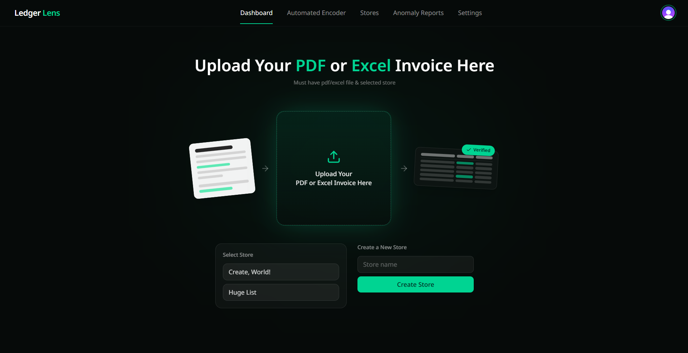
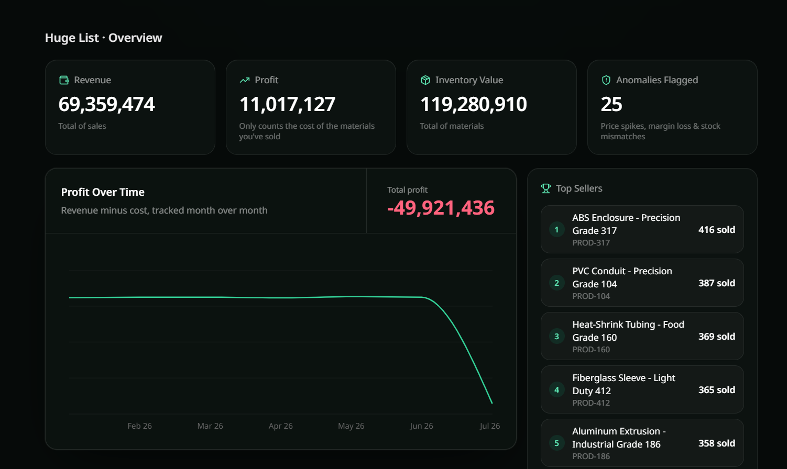
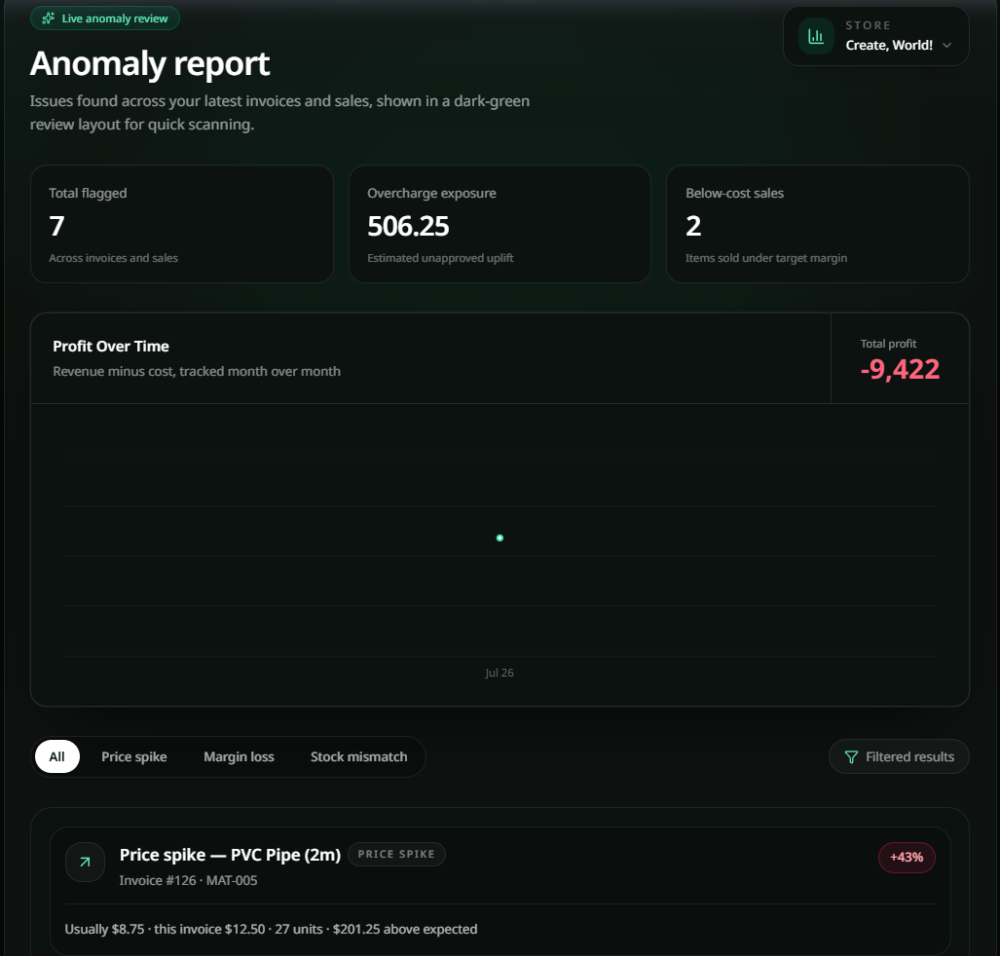

# Ledger Lens 🔍

> **Automated inventory audit and profit protection for high-volume ledger data.**

## 📌 Overview
Ledger Lens eliminates manual ledger auditing by processing thousands of material and sales line items in seconds. It automatically flags hidden supplier price spikes, negative margin sales, and inventory stock mismatches before they eat into business profitability.

---

## ✨ Key Features

### 📊 Real-Time Financial Dashboard & Upload
* **Batch Encoding:** Upload Excel (`.xlsx`, `.csv`) invoice sheets to encode materials and sales directly into selected stores.
* **Executive Metrics:** Live tracking of **Revenue, Profit, Inventory Value,** and total **Anomalies Flagged**.
* **Visual Analytics:** Profit trends plotted over time alongside top 5 selling materials.

### 🚨 Automated Anomaly Engine
* **Price Spikes:** Automatically detects material costs that exceed expected preset prices.
* **Margin Loss:** Highlights materials sold at a loss compared to their purchase cost.
* **Stock Mismatch:** Identifies inventory items where sold units exceed recorded stock levels.

### ⚙️ Thresholds & Store Management
* **Custom Alert Rules:** Set custom thresholds for Price Spikes, Margin Loss, and Stock Mismatch to hide non-critical noise.
* **Bulk Preset Sheets:** Upload master cost sheets by SKU to auto-assign preset baseline prices across materials.

---

## 🛠️ Tech Stack
* **Frontend:** React, Tailwind CSS
* **Backend:** Node.js, Express.js
* **Database & ORM:** PostgreSQL, Drizzle ORM
* **Authentication:** Clerk
* **Inference Engine:** Groq API